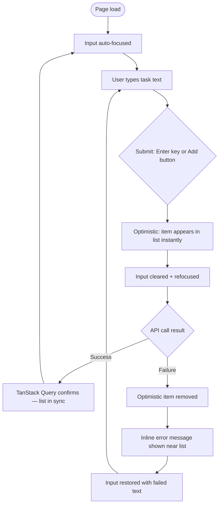
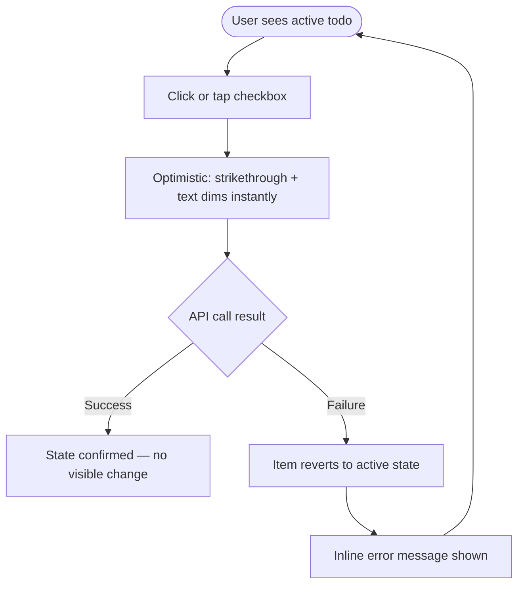
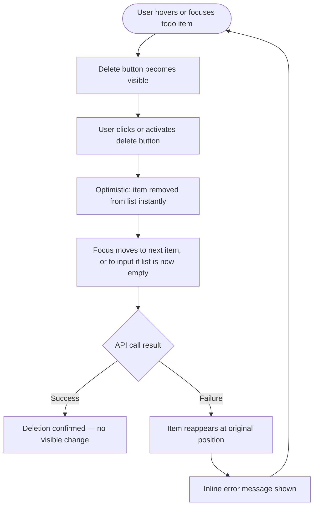
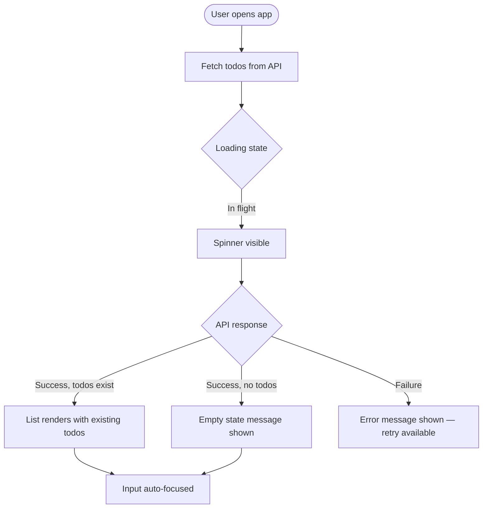

# UX Design Specification bmad-todo

**Author:** Giulia
**Date:** 2026-03-10

---

## Executive Summary

### Project Vision

bmad-todo is a deliberately minimal, production-quality full-stack todo application built for a senior developer. Its feature surface is narrow by design — create, view, complete, and delete todos — so that all UX effort goes into doing those four things exceptionally well. The UX must feel instant and polished, reflecting senior developer taste while remaining intuitive enough for a non-technical user encountering it cold on mobile.

### Target Users

| User                    | Context                             | Key UX Expectation                                                              |
| ----------------------- | ----------------------------------- | ------------------------------------------------------------------------------- |
| **Giulia** (primary)    | Desktop-first, developer, daily use | Zero jank. Instant feedback. Predictable, no surprises.                         |
| **Husband** (casual)    | Mobile, non-technical, occasional   | Completely self-evident — works without any explanation                         |
| **Developer colleague** | Desktop, evaluative lens            | Craft visible in the details: focus management, animation timing, accessibility |

### Key UX Design Challenges

1. **Density vs. clarity on mobile** — The list must be scannable on a 375px screen without crowding interactive controls (checkbox, delete button) against the todo text.
2. **Optimistic feedback loop** — The invisible transition from "optimistic item" → "server-confirmed item" under success, and clearly communicated rollback on failure, without being alarming or disruptive.
3. **Focus management discipline** — After create (input clears + refocuses), after delete (focus moves to next item or back to input) — interactions must feel natural, not mechanical or surprising.

### Design Opportunities

1. **The completion moment as a signature interaction** — The strikethrough-and-fade animation when a todo is marked done is a micro-delight that defines the app's personality. Getting it right elevates the whole experience.
2. **Empty state as personality** — With such minimal scope, the empty state and typography have outsized influence on how polished the app feels overall.
3. **Accessibility as visible quality signal** — For a developer-audience app, demonstrably good focus rings, ARIA labels, and keyboard flow signal craftsmanship that a colleague will notice and respect.

## Core User Experience

### Defining Experience

The primary user action — creating a todo and seeing it appear instantly — defines the entire product feel. The create moment is the first thing any user does, and if it feels fast and satisfying, trust in the whole app is established immediately. All other mutations (toggle, delete) follow the same instant-feedback pattern.

### Platform Strategy

- **Primary platform:** Web SPA, single screen, no navigation
- **Primary interaction mode:** Desktop — mouse + full keyboard operability required
- **Secondary interaction mode:** Mobile touch — 375px minimum viewport, touch targets ≥44×44px (WCAG 2.5.5)
- **Offline:** Not required — server state is authoritative; no client-side queue needed

### Effortless Interactions

These actions must require zero conscious thought:

- Typing in the input and pressing **Enter** to add a todo — no button hunting required
- **Clicking/tapping a checkbox** to toggle completion — hit area must be generous, not just the checkbox itself
- **Delete button** visible inline on each item — no long-press, no swipe gesture, no confirmation modal for this scope

### Critical Success Moments

1. **The instant create** — Todo appears in the list before the network round-trip completes. If this lags, the whole app feels broken.
2. **The completion animation** — Strikethrough renders with a smooth, subtle transition. This is the tactile payoff of the entire interaction loop.
3. **Persistence across reload** — User refreshes; todos are still there. Quietly validates that the app can be trusted.
4. **Graceful error recovery** — An API call fails; a clear, non-alarming message appears; the UI reverts cleanly. Confidence is preserved.

### Experience Principles

1. **Speed is the feature** — Optimistic updates on all mutations; the UI never blocks waiting for a server response
2. **Invisible infrastructure** — Persistence, error recovery, and state sync happen silently unless something goes wrong
3. **Focused simplicity** — One screen, one list, four actions; no settings, no modes, no navigation to get lost in
4. **Craft in the details** — Animation timing, focus management, accessible names — these are not polish, they are the standard

## Desired Emotional Response

### Primary Emotional Goals

**Calm confidence.** The app should feel like a reliable, quiet tool — always ready, never surprising in a bad way. Using it should feel like the tool is on the user's side. Delight here comes from polish, not personality.

### Emotional Journey Mapping

| Moment                  | Desired Feeling                                                  |
| ----------------------- | ---------------------------------------------------------------- |
| Opening the app         | Oriented immediately — list is right there, no friction          |
| Creating a todo         | Satisfied — it appeared instantly, I'm in control                |
| Completing a todo       | Accomplished — the animation gives a small reward for the action |
| Deleting a todo         | Clean — it's gone, the list is tidier                            |
| Something goes wrong    | Reassured — clear message, nothing lost, easily recoverable      |
| Returning after a break | Trusted — everything is exactly as I left it                     |

### Micro-Emotions

**Cultivate:**

- **Confidence** over confusion — interactions are predictable and consistent
- **Accomplishment** over mere satisfaction — the completion animation earns the feeling
- **Trust** over skepticism — persistence and error recovery build it quietly over time
- **Focus** over engagement — this is a tool, not an experience; calm is the goal

**Avoid:**

- Anxiety about data loss
- Frustration from laggy or unresponsive UI
- Confusion about what state the app is in
- Distraction from the task at hand

### Design Implications

| Emotion         | UX Design Approach                                                                      |
| --------------- | --------------------------------------------------------------------------------------- |
| Calm confidence | Muted colour palette; no loud alerts; transitions are smooth, not jarring               |
| Accomplishment  | Completion animation is deliberate and satisfying, not flashy                           |
| Trust           | Error messages are honest, specific, and non-scary — never "Something went wrong" alone |
| Focus           | No unnecessary chrome, modals, or confirmations cluttering the single-screen layout     |

### Emotional Design Principles

- The app should feel quieter than you expect — minimal visual noise
- Delight comes from polish, not personality or illustration
- Errors are handled professionally — clear, calm, actionable

## UX Pattern Analysis & Inspiration

### Inspiring Products Analysis

**1. Linear (linear.app)**
Razor-focused single-purpose workflow tool; keyboard-first; no modal overload. Subtle animations that feel earned, not decorative. Inline actions on list items appear on hover — keeps the list visually clean at rest.

**2. Things 3 (Cultured Code)**
Gold standard for task management UX polish. The completion "magic move" animation is iconic and genuinely satisfying. Careful typographic hierarchy; empty states are friendly and purposeful without being cutesy.

**3. Vercel Dashboard**
Developer-audience UI: dense but readable; muted palette; excellent error states. Trust conveyed through consistency and precise feedback, not reassuring copy. Errors appear inline with the action that failed, not as a banner far removed from the problem.

### Transferable UX Patterns

| Pattern                         | Source   | Application to bmad-todo                                                 |
| ------------------------------- | -------- | ------------------------------------------------------------------------ |
| Hover-reveal inline actions     | Linear   | Show delete button on item hover/focus; keep list visually clean at rest |
| Satisfying completion animation | Things 3 | CSS transition: strikethrough sweeps across text + subtle opacity fade   |
| Purposeful empty state          | Things 3 | Short message + subtle suggestion to add first task                      |
| Error co-located with action    | Vercel   | Show API failure message near the list, not at page top                  |
| Keyboard-first affordances      | Linear   | Enter to submit, clear focus indicators, tab order follows visible flow  |

### Anti-Patterns to Avoid

- **Confirmation modals for delete** — adds friction for a simple, low-stakes action at this scope
- **Toast notifications floating bottom-right** — disconnects the error from the action that caused it
- **Skeleton loaders with complex shapes** — overkill for a simple list; a single spinner or subtle fade-in is appropriate
- **Staggered item entrance animations** — feels playful and distracting, conflicts with the "calm and focused" emotional goal

### Design Inspiration Strategy

- **Adopt:** Hover-reveal delete action (Linear); earnest completion animation (Things 3)
- **Adapt:** Vercel's inline error approach — simplified for a single-list context
- **Avoid:** Anything that makes the app feel busier than it is — modals, toasts, staggered entrance animations

## Design System Foundation

### Design System Choice

**Custom lightweight design system using plain CSS + CSS custom properties.**

No component library. No utility-first framework. Hand-crafted styles with full intentionality — the architecture mandates this, and it is the right choice for a developer-audience app where the absence of a framework fingerprint is itself a quality signal.

### Rationale for Selection

- **Architecture-mandated:** The architecture spec explicitly requires "Plain CSS with CSS custom properties; mobile-first"
- **Full visual control:** Every colour, spacing, and transition decision is deliberate and attributable
- **Zero framework overhead:** No bundle weight from a component library; no fighting against someone else's defaults
- **WCAG AA tunable:** Custom properties make it trivial to verify and adjust contrast ratios
- **Developer-audience credibility:** A senior developer peer will notice that there is no MUI or Tailwind fingerprint — that is a quality signal

### Implementation Approach

Design tokens as CSS custom properties on `:root`:

| Token namespace | Examples                                                                                                |
| --------------- | ------------------------------------------------------------------------------------------------------- |
| `--color-*`     | `--color-bg`, `--color-text`, `--color-text-muted`, `--color-accent`, `--color-error`, `--color-border` |
| `--space-*`     | `--space-1` (4px) through `--space-8` (32px) — 4px base grid                                            |
| `--radius-*`    | `--radius-sm`, `--radius-md`                                                                            |
| `--duration-*`  | `--duration-fast` (150ms), `--duration-base` (250ms)                                                    |
| `--font-*`      | `--font-size-sm`, `--font-size-base`, `--font-weight-normal`, `--font-weight-medium`                    |

### Customisation Strategy

- `App.css` owns all tokens and global resets
- Component styles co-located with components (CSS modules or scoped files)
- System font stack for performance and platform-native feel: `-apple-system, BlinkMacSystemFont, 'Segoe UI', sans-serif`
- No third-party icon libraries — minimal inline SVG for the delete and checkbox icons

## Core User Experience

### Defining Experience

> **"Type a task and press Enter. It's there instantly."**

That is the defining moment of bmad-todo. The create interaction — fast, keyboard-native, optimistic — is the one thing that, if nailed, makes everything else feel trustworthy. All other mutations (toggle, delete) follow the same instant-feedback pattern, but create is where users form their first impression.

### User Mental Model

Users arrive with a universal mental model: a todo app is a fast scratchpad, quicker than opening a notes app, that just works. They expect:

- The input to be focused and ready on load — no click needed
- Enter to commit the item
- No wait, no reload, no friction

What they dislike in other apps: clicking a button to submit, waiting for a list reload, losing input on error, or seeing a blank screen during load. bmad-todo addresses every one of these.

### Success Criteria

- Input is auto-focused on page load
- Enter submits; item appears in the list before network response returns
- Input clears and refocuses immediately after submission
- On API failure: item disappears cleanly; error message explains what happened; input retains the failed text for retry
- The full loop — type → Enter → see it in list — feels sub-100ms to the user

### Novel vs. Established Patterns

This is 100% established pattern — the `<input>` + Enter submit is universally understood. Innovation is _within_ the pattern: optimistic updates and precise focus management, not a reinvented interaction. Correct for a focused utility tool.

### Experience Mechanics

| Phase                   | What happens                                                                                        |
| ----------------------- | --------------------------------------------------------------------------------------------------- |
| **Initiation**          | Page loads → input auto-focused, placeholder invites entry                                          |
| **Interaction**         | User types → presses Enter (or taps submit button on mobile)                                        |
| **Optimistic feedback** | Item instantly appears in list with subtle fade-in; input clears and refocuses                      |
| **Server confirmation** | TanStack Query reconciles — seamless and invisible on success                                       |
| **Error state**         | Item removed from list; inline error message appears near list; input retains failed text for retry |
| **Completion**          | User is back at focused input, ready for next task — no extra clicks                                |

## Visual Design Foundation

### Color System

A **neutral light theme** — off-white background, near-black text, a single restrained indigo accent for interactive states, and a clear error red. No saturated or vibrant colours.

| Token                  | Value     | Usage                                         |
| ---------------------- | --------- | --------------------------------------------- |
| `--color-bg`           | `#FAFAFA` | Page background                               |
| `--color-surface`      | `#FFFFFF` | Card/input surface                            |
| `--color-border`       | `#E5E7EB` | Dividers, input borders                       |
| `--color-text`         | `#111827` | Primary text                                  |
| `--color-text-muted`   | `#6B7280` | Placeholder, secondary labels                 |
| `--color-accent`       | `#4F46E5` | Focus rings, checkbox checked state           |
| `--color-accent-hover` | `#4338CA` | Accent hover state                            |
| `--color-error`        | `#DC2626` | Error messages, optimistic rollback indicator |
| `--color-completed`    | `#9CA3AF` | Completed todo text (dimmed)                  |

All colour pairs meet WCAG AA contrast minimums: primary text on bg ≥ 7:1; muted text ≥ 4.5:1; accent on white ≥ 3:1 for large/UI text.

### Typography System

System font stack — no web font loading delay, immediate render, platform-native feel.

| Token                  | Value                                                       | Usage                               |
| ---------------------- | ----------------------------------------------------------- | ----------------------------------- |
| `--font-family`        | `-apple-system, BlinkMacSystemFont, 'Segoe UI', sans-serif` | All text                            |
| `--font-size-sm`       | `0.875rem` (14px)                                           | Labels, error messages, empty state |
| `--font-size-base`     | `1rem` (16px)                                               | Todo text, input                    |
| `--font-size-lg`       | `1.125rem` (18px)                                           | App heading                         |
| `--font-weight-normal` | `400`                                                       | Body, todo text                     |
| `--font-weight-medium` | `500`                                                       | Interactive labels, headings        |
| `--line-height-base`   | `1.5`                                                       | All body text                       |

Completed todo text: `text-decoration: line-through` + `color: var(--color-completed)` — no size or weight change.

### Spacing & Layout Foundation

4px base grid. Single centered column, max-width constrained.

| Token       | Value  |
| ----------- | ------ |
| `--space-1` | `4px`  |
| `--space-2` | `8px`  |
| `--space-3` | `12px` |
| `--space-4` | `16px` |
| `--space-6` | `24px` |
| `--space-8` | `32px` |

- **Layout:** Single centered column, `max-width: 640px`, `padding: 0 var(--space-4)` on mobile
- **Item row height:** Minimum 48px for touch target compliance
- **White space philosophy:** Airy within the list — tight spacing would feel anxious and cluttered

### Accessibility Considerations

- All interactive elements have a visible `:focus-visible` ring using `--color-accent` (3px, 2px offset)
- Touch targets minimum 44×44px on all interactive elements (WCAG 2.5.5)
- Colour is never the sole indicator of state: strikethrough + colour change for completion; icon + colour + text for errors
- Error messages linked to their source via `aria-describedby` or proximity in the DOM

## Design Direction Decision

### Chosen Direction

**Direction A — Minimal Light** (from the 6-direction exploration in `ux-design-directions.html`).

### Design Rationale

- Off-white background (`#FAFAFA`), near-black text, single indigo accent — matches the "calm confidence" emotional goal precisely
- Hover-reveal delete button (inspired by Linear) keeps the list visually clean at rest; reduces visual clutter on desktop
- Inline action layout (checkbox left, delete right) is the universal mental model for todo lists — no user education needed
- No card elevation, no drop shadows on items — the simplicity is intentional and signals quality to a developer audience
- Indigo accent (`#4F46E5`) provides sufficient contrast for focus rings and interactive states without being aggressive

### Implementation Notes

- Delete button is always keyboard-accessible (`:focus-visible`) even when visually hidden at rest
- On mobile (touch), delete button is always visible (no hover state) — `@media (hover: none)` rule
- Chosen direction maps directly to the CSS custom properties defined in the Visual Foundation section

## User Journey Flows

### Journey 1: Create a Todo

The primary and most frequent user action.

**Key decisions:**

- Auto-focus on load eliminates an extra click for every session
- Input cleared and refocused on success supports rapid sequential entry
- Failed text restored on error preserves user's work and enables single-click retry

### Journey 2: Complete a Todo

The signature interaction — the moment that defines the app's feel.

**Key decisions:**

- Optimistic toggle is instant — zero perceptible latency
- Animation plays on `isCompleted` state change: CSS `transition` on `text-decoration` and `color`
- Revert is silent unless there's an error — no unnecessary feedback on success

### Journey 3: Delete a Todo

**Key decisions:**

- No confirmation dialog for delete — the action is immediate and reversible only via re-add (acceptable at this scope)
- Focus management is explicit: next item → input. Prevents focus lost in void
- On touch devices, delete button always visible (no hover dependency)

### Journey 4: Initial Load (First Visit / Return)

### Journey Patterns

| Pattern                        | Applied in                   | Detail                                                      |
| ------------------------------ | ---------------------------- | ----------------------------------------------------------- |
| **Optimistic mutation**        | Create, Toggle, Delete       | All three mutations update UI before API response           |
| **Inline error proximity**     | All mutations                | Error message appears near the list, not as a distant toast |
| **Auto-focus after action**    | Create success, Create error | Input always ready for next entry                           |
| **Explicit focus management**  | Delete                       | Focus moves to logical next target, never lost              |
| **State reversion on failure** | Toggle, Delete               | UI silently rolls back; error message explains why          |

### Flow Optimisation Principles

- **Minimum steps to value:** Create requires exactly 2 actions (type + Enter); zero clicks before typing
- **No dead ends:** Every error state has a clear path back to the task (restored input, reverted item)
- **Consistent mental model:** All three mutations follow the same pattern — instant UI update → server sync → error revert
- **Progressive disclosure:** Delete button hidden at rest (desktop) to keep the list scannable; revealed on hover/focus

## Component Strategy

### Custom Components

All components are bespoke React functional components — no third-party library. Styles via CSS modules using `var(--token)` from `App.css`.

| Component        | Priority | Purpose                                                                                          |
| ---------------- | -------- | ------------------------------------------------------------------------------------------------ |
| `TodoList`       | Critical | `<ul role="list">` with `aria-live="polite"`; renders items or delegates to loading/empty states |
| `TodoItem`       | Critical | `<li>` row: checkbox + text + delete button; hover-reveal delete on desktop                      |
| `AddTodoForm`    | Critical | `<form>` with text input (auto-focused) + submit button; keyboard-first                          |
| `LoadingSpinner` | High     | CSS-animated; `role="status"` `aria-label="Loading todos"`                                       |
| `EmptyState`     | High     | Friendly prompt when list is empty; placed in the list area                                      |
| `ErrorMessage`   | High     | `
` shown inline near list on mutation failure                                    |

### Component Specifications

**`AddTodoForm`** — States: default (focused), submitting (button disabled), error (input shows failed text). Empty input does not submit. `aria-label` on button; `aria-describedby` to error when present.

**`TodoItem`** — States: active, completed (strikethrough + `--color-completed`), deleting (optimistic remove). Checkbox `aria-label="Mark complete: {text}"` / `"Mark incomplete: {text}"`. Delete `aria-label="Delete: {text}"`. Delete always focusable. Tab order: checkbox → delete → next item.

**`TodoList`** — `aria-live="polite"` announces add/delete to screen readers. Shows `LoadingSpinner` during fetch, `EmptyState` when list is empty.

**`ErrorMessage`** — `role="alert"` for immediate screen reader announcement. Dismissed on next successful operation.

### Implementation Strategy

- Delete button visibility: `opacity: 0` at rest → `opacity: 1` on `.todo-item:hover` / `:focus-within`
- `@media (hover: none)` overrides to always-visible on touch devices
- Component styles co-located as CSS modules; global tokens from `App.css`

## UX Consistency Patterns

### Button Hierarchy

| Level                         | Usage                  | Visual                                          |
| ----------------------------- | ---------------------- | ----------------------------------------------- |
| **Primary**                   | Add todo (form submit) | Filled, `--color-accent` background, white text |
| **Destructive**               | Delete todo            | No background at rest; red text on hover/focus  |
| **No tertiary/ghost buttons** | N/A for this scope     | Single-screen app needs no secondary actions    |

All buttons: minimum 44×44px tap target; visible `:focus-visible` ring.

### Feedback Patterns

| Situation            | Pattern                         | Visual                                                              |
| -------------------- | ------------------------------- | ------------------------------------------------------------------- |
| Initial data loading | Spinner in list area            | CSS animation, `role="status"`                                      |
| Optimistic mutation  | Instant UI change               | No indicator needed — speed is the feedback                         |
| Mutation success     | Silent — no notification        | Trust the optimistic update; confirmation adds noise                |
| Mutation failure     | Inline `ErrorMessage` near list | `role="alert"`, `--color-error` text, revert happens simultaneously |
| Empty list           | `EmptyState` in list area       | Friendly message, no icon required                                  |

**Key principle:** success is silent; only failures speak.

### Form Patterns

- Single form field — no multi-field complexity
- **Validation:** client-side only for empty input (do not submit); server errors shown via `ErrorMessage`
- **Submission:** Enter key primary; button secondary (mobile tap)
- **Post-submit:** input cleared + refocused on success; input restored with failed text on error
- No floating labels — static placeholder text is sufficient for a single-field form

### Loading & Empty State Patterns

- **Loading:** spinner replaces list area (not overlay); never shows stale content during initial load
- **Empty:** message in list area, not a full-page illustration; concise, non-apologetic copy
- **Optimistic items:** visually identical to confirmed items — no "pending" indicator needed

### Error Pattern Rules

- Errors appear near the content they relate to (proximity), not in a toast or a page header
- Error copy is specific: describes what failed and implicitly how to recover
- Errors clear automatically on the next successful operation of the same type
- `role="alert"` on all error messages for screen reader announcement

## Responsive Design & Accessibility

### Responsive Strategy

**Mobile-first.** Base styles target mobile (375px); media queries expand upward. The single-column layout means no complex collapse logic — only spacing, sizing, and interaction-mode adaptations change between breakpoints.

- **Desktop:** Max-width 640px centered column; extra horizontal space becomes white space — intentional
- **Tablet:** Identical to desktop within the same CSS; no tablet-specific breakpoint needed
- **Mobile:** Full-width with `var(--space-4)` padding; touch targets enforced; delete button always visible

### Breakpoint Strategy

| Breakpoint             | Value   | Purpose                                       |
| ---------------------- | ------- | --------------------------------------------- |
| Base (mobile-first)    | 0px+    | Full-width layout, touch-optimised            |
| `--bp-md`              | `640px` | Max-width constraint; centered column         |
| `@media (hover: none)` | —       | Delete button always visible on touch devices |

Two breakpoints only — additional breakpoints would be over-engineering for this scope.

### Accessibility Strategy

**Target: WCAG 2.1 Level AA** (architecture requirement: zero critical violations from automated audit).

| Requirement                     | Implementation                                                       |
| ------------------------------- | -------------------------------------------------------------------- |
| Colour contrast ≥4.5:1          | All token pairs verified in Visual Foundation                        |
| Keyboard fully operable         | Tab order through list; Enter/Space for all actions                  |
| Focus visible                   | `:focus-visible` ring on all interactive elements                    |
| Screen reader compatible        | Semantic HTML + ARIA labels on all interactive elements              |
| ARIA live regions               | `aria-live="polite"` on `TodoList` for add/delete announcements      |
| Touch targets ≥44×44px          | Min row height 48px; button sizes from token spec                    |
| No colour-only state indicators | Strikethrough + colour for completion; text + colour for errors      |
| Focus management                | After create: input refocused. After delete: next item or input      |
| Reduced motion                  | Animations disabled/simplified when `prefers-reduced-motion: reduce` |

### Testing Strategy

- **Automated:** axe-core via Playwright accessibility checks (E2E suite, Story 3.2)
- **Keyboard:** Manual Tab/Enter/Space walkthrough of all four interactions
- **Screen reader:** VoiceOver (macOS/iOS) smoke test — verify list announcements and button labels
- **Responsive:** Browser devtools at 375px, 768px, 1280px; real device for touch target validation
- **Colour contrast:** Verified against defined tokens via devtools or contrast checker

### Implementation Guidelines

**Responsive:**

- All spacing via `var(--space-*)` — no hardcoded pixel values
- Root container: `max-width: 640px; margin: 0 auto; padding: 0 var(--space-4)`
- `min-height: 48px` on `TodoItem` rows
- `@media (hover: none) { .btn-delete { opacity: 1; } }`

**Accessibility:**

- `<label>` (visually hidden if needed) on the todo input — never placeholder-only
- `<ul>` / `<li>` for list — not `
` elements
- `<button type="button">` for delete; `<input type="checkbox">` for toggle — native semantics only
- `aria-live="polite"` on the `<ul>` element itself
- `@media (prefers-reduced-motion: reduce) { * { transition-duration: 0.01ms !important; } }`
